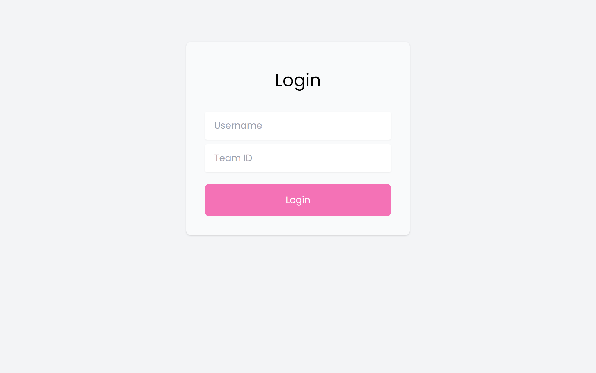
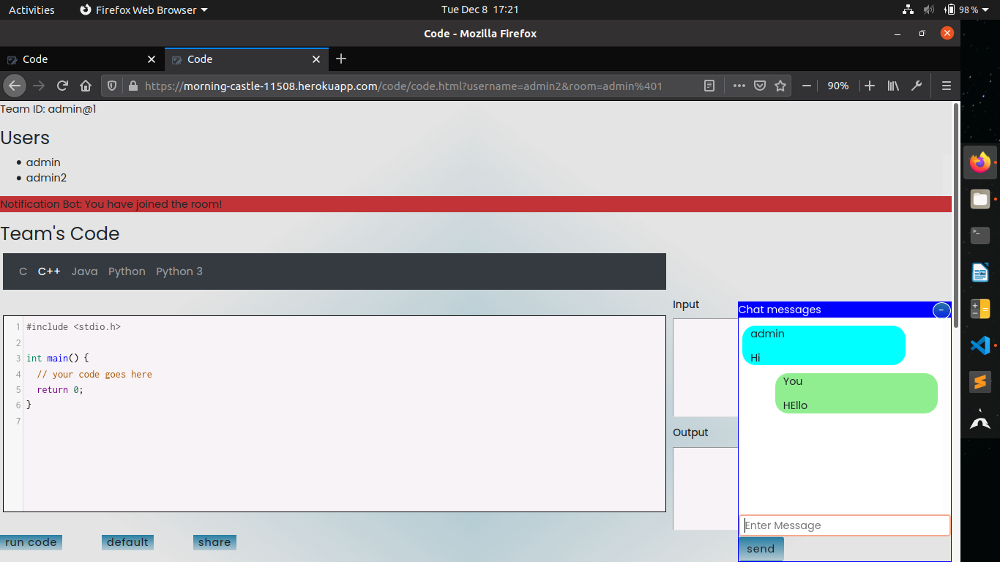
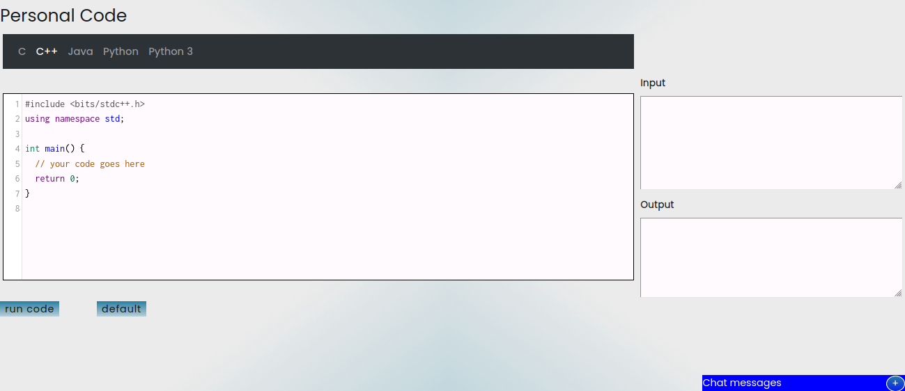
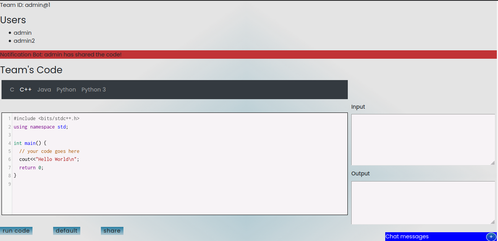

# RTE - Real Time IDE Environment

**DESCRIPTION**

Developers often need to share code for coding contests, pair-programming, troubleshooting issues and teaching. Our main purpose is to minimize the extra time we take to share the code and setup it. Overall the web application is best suited for Team Contests.

**IDEA** - 

    1. To reduce the time span and effort which it takes to share as well as to setup
       the coding environment among the team members.
    2. Allow multiple users to work on a code at the same time.
    3. The team members can chat with each other via chat section.
    4. Can be used as Team as well as Personal IDE.
    5. Reduce the time and effort to communicate our code. 
          
          
**TECH STACK**

    1. HTML
    2. CSS
    3. JAVASCRIPT
    4. NODE
    5. SOCKETS
    6. Text-Formatter
        a. CodeMirror
    7. APIS
        a. Sphere Engine

**SCREENSHOTS** 

